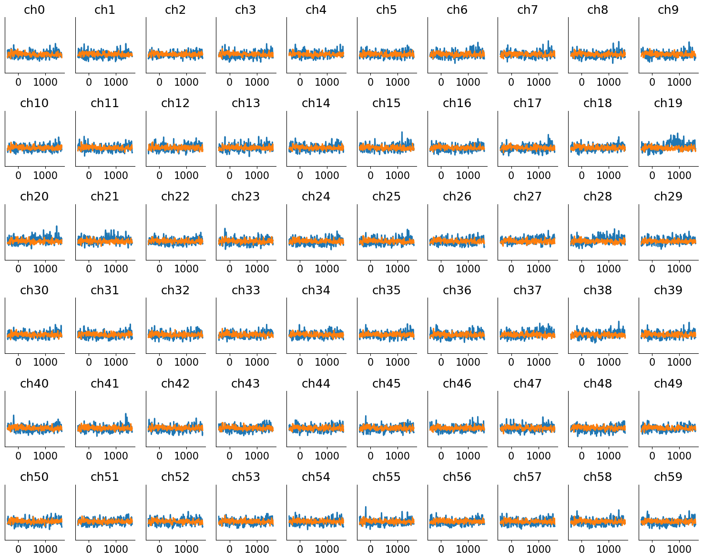
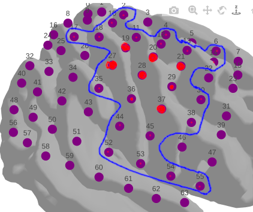

Assignment 1 - & Computational Programming
YOUR FULL NAME HERE

Netid: Your netid here

Names of students you worked with on this assignment: LIST HERE IF APPLICABLE (delete if not)

Note: this assignment falls under collaboration Mode 2: Individual Assignment – Collaboration Permitted. Please refer to the syllabus on Canvas for additional information.

Instructions for all assignments can be found here, and is also linked to from the course syllabus.

Total points in the assignment add up to 90; an additional 10 points are allocated to presentation quality.
Learning Objectives

The purpose of this assignment is to provide a refresher on fundamental concepts that we will use throughout this course, and provide an opportunity to develop skills in any of the related skills that may be unfamiliar to you. Through the course of completing this assignment, you will...

    Practice numerical programming by loading and filtering data, plotting data, vectorizing operations, profiling code speed, and debugging and optimizing performance. You will also practice computing probabilities based on simulation.
    Develop or refresh your knowledge of Git version control, which will be a core tool used in the final project of this course
    Apply your skills altogether through an exploratory data analysis to practice data cleaning, data manipulation, interpretation, and communication

We will build on these concepts throughout the course, so use this assignment as a catalyst to deepen your knowledge and seek help with anything that is unfamiliar.

Note: for all assignments, write out all equations and math using markdown and LaTeX. For this assignment show ALL math work

ANSWER
Numerical Programming
1

[30 points] Loading data and gathering insights from a real dataset

In data science, we often need to have a sense of the idiosyncrasies of the data, how they relate to the questions we are trying to answer, and to use that information to help us to determine what approach we may need to apply to achieve our goal. This exercise provides practice in exploring a dataset and answering question that might arise from applications related to the data.

Data. The data for this problem can be found in the data subfolder in the assignments folder on github. The filename is stroke.csv.

A stroke occurs when the blood flow to a part of the brain is reduced or restricted. Due to this brain cells start to die, in that part of the brain, at a very fast rate due to a lack of oxygen and nutrients. There are two types of brain strokes: (a) Ischemic stroke and (b) Haemorrhagic stroke of which ischemic stroke is more likely to occur. The rupture or blockage prevents blood and oxygen from reaching the brain’s tissues. Here we have used 8 input parameters like gender, age, various diseases, and smoking status in this dataset on brain stroke detection from Kaggle. The following information is provided about the patient:
field 	description
id 	unique identifier
gender 	'Male', 'Female', or 'Other'
age 	age of patient
hypertension 	0 if patient doesn't have hypertension; 1 if patient has hypertension
heart_disease 	0 if patient doesn't have heart disease; 1 if patient has heart disease
ever_married 	'No', 'Yes'
work_type 	'children', 'Govt_jov', 'Never_worked', 'Private', 'Self-employed'
Residence_type 	'Rural', 'Urban'
avg_glucose_level 	average glucose level of the patient
bmi 	body mass index of the patient
smoking_status 	'formerly smoked', 'never smoked', 'smokes', 'Unknown'
stroke 	0 if patient has not had a stroke; 1 if patient has had a stroke

Your objective. For this dataset, your goal is answer the following questions about these patients:

(a) Calculate the bmi mean and standard deviation for patients who have had a stroke. Calculate the bmi mean and standard deviation for patients who have had NOT had a stroke.
Done()
(b) Assess the NA values in the data. Count the rows that have stroke as 0 and 1 respectively when bmi is null.
Done()
(c) Recalculate the bmi mean and standard deviation for patients who have had and have not had a stroke. Plot this data as a box plot.

(d) Plot the same boxplot as above, but with the raw data plotted. What additional information does this raw data provide? Briefly explain the differences between the plots shown in c and d.

(e) Plot a histogram of age distributions of the patients that have had strokes and patients that have not had strokes.

(f) Plot a density plot of age distributions of the patients that have had strokes and patients that have not had strokes. How is this plot different from the histogram plotted in e?

(g) Plot a density plot of age distributions of the patients that have had strokes and patients that have not had strokes, by gender.

(h) Plot a density plot of age distributions of the patients that have had strokes and patients that have not had strokes, by gender 'Male' and 'Female'. What changes with this plot relative to what you plotted for g?

ANSWER
See comments at bottom of analyze_stroke_data.py
Version Control via Git
2

[10 points] Git is efficient for collaboration, and expectation in industry, and one of the best ways to share results in academia. You can even use some Git repositories (e.g. Github) as hosts for website, such as with the course website. As a data scientist with experience in machine learning, Git is expected. We will interact with Git repositories (a.k.a. repos) throughout this course, and your project will require the use of git repos for collaboration.

Complete the Atlassian Git tutorial, specifically the following listed sections. Try each concept that's presented. For this tutorial, instead of using BitBucket as your remote repository host, you may use your preferred platform such as Github or Duke's Gitlab.

    What is version control
    What is Git
    Install Git
    Setting up a repository
    Saving changes
    Inspecting a repository
    Undoing changes
    Rewriting history
    Syncing
    Making a pull request
    Using branches
    Comparing workflows

I also have created two videos on the topic to help you understand some of these concepts: Git basics and a step-by-step tutorial.

For your answer, affirm that you either completed the tutorials above OR have previous experience with ALL of the concepts above. Confirm this by typing your name below and selecting the situation that applies from the two options in brackets.

ANSWER

I, Aaron Raycove, affirm that I have completed the above tutorial

Exploratory Data Analysis
3

[50 points] Here you'll bring together some of the individual skills that you demonstrated above and perform exploratory data analysis. Your goal is to explore the datasets available and identify questions or problems you're interested in working with. Below, we walk through a process to follow for your analysis.

    Find 3 datasets that interest you. I provide you with several opensource here here, but feel free to look for others!
    For each of the 3 datasets, describe the dataset, the source of the data, and the reason the dataset was of interest. What question are you hoping to answer through exploring the dataset?
    Check the data and see if they need to be cleaned: are there missing values? Are there clearly erroneous values? Do two tables need to be merged together? Clean the data so it can be visualized. If the data are clean, state how you know they are clean (what did you check?).
    Plot the data, demonstrating interesting features that you discover. Are there any relationships between variables that were surprising or patterns that emerged? Please exercise creativity and curiosity in your plots. You should have at least a ~3 plots exploring the data in different ways ... so at least 9 plots total.
    What insights are you able to take away from exploring the data? Is there a reason why analyzing the dataset you chose is particularly interesting or important? Summarize this for a general audience - boil down your findings in a way that is accessible, but still accurate.
    Define a clear question for each dataset that you would be interested in working on for the remainder of the semester. Be prepared to pitch your project proposals to the class!

ANSWER
# Overall Interest Statement
I'm taking this class as a means to learn how to better analyze data, and introduce myself to the broader body of research, so that I may apply conclusions and finding of "cutting-edge" research to an ongoing project to develop software that will serve as a cognitive enhancement to allow the user to learn anything and retain everything they learn at a rapid pace. Thus my interest lies in studies that study how memory is formed, retained and altered. Any study that examines how memories are manipulated is of great interest.

# Dataset 1
## Description
DougEtal23.data, study and dataset gets data on forward and backwards recall of items in a list. A list of random items is read to the "subject" and the subject is asked to recite the list back. Study highlights the serial position effect.
## Source of Data
Darpa Program - University of Pennsylvania

## Reason of Interest
The serial position effect examined here, gives insights into how we might be able to structure lesson plans in such a way that enhances the quality of education.

## Question to be answered
How does the order in which information is presented and asked to be recalled in effect the ability to recall? How does the content of the information coupled with its order effect the ability to recall that information?

The study only seems to answer the first part of that question. So my follow up is what if we experiment with the contents of the list, What if we add a multiple day, month, year, follow up component?

What's the actual usefulness of such data without any recording of any brain signals?

## is_clean?
The data is clean, and the study comes with .ipynb code block detailing how the data was cleaned. Data is given in both raw and clean form. So while we can clean the data ourselves, it is not entirely necessary to do so.

Subjects who did not recall anything were excluded from the data-sets
no-response csv file is provided but is separated from the rest of the results.

## Any erroneous values or missing values
The cleaned data-sets provided do not appear to be missing values.
However not all records are full, but this is not due to missing values. For example the intrusion value is only recorded during a recall session. Intrusion is left empty or (not-applicable) not that it is erroneous or missing

## Three plots for dataset
Probability analysis
We are more likely to recall the first positions than the last positions of items in a list
However we are more likely to recall the last positions more than middle positions

This is reinforced based on variations of sorting methods
Strict sorting vs murdock sorting
.png>) vs .png>)
with strict sorting the probability of recalling the following item decreases rapidly. This aligns with probability theory. If given event a and event b. Its always more likely that event a occurs more than both event a and event b occur. So strict sorting reinforces what we already know about probability
Removing the strict sorting reveals a different picture. The first and last items are equally probable to be remembered, if we don't consider order of recall.

Note taking is highly emphasized in class-room settings. Though in my experience, we rarely go back and review those same notes. This data also helps explore whether this practice is useful or not.

Separating people out based on whether they took notes or did not take notes to remember what items were in the list gives interesting results.
Those who didn't take notes and thus actively paid attention to the list recital had better recall of the list than those who wrote notes(probably because they were distracted and thus had their attention split between hearing and processes those cues into motor control)

## Insights / Summarization
- Subjects who took notes ended up having poorer recall
    - (so it would seem to me, that taking notes in this case served as a distraction. So we can likely conclude that taking notes does not help to improve memory)

- Reinforcement of the Serial-Position Effect first discovered in 1962

Though I'm a bit cautious of the applicability of the study. As the data is only a short-term set, we aren't testing recall over repititions, and especially not over an extended multi-year test.

# Dataset 2
## Description
The HCP 7T retinotopyy dataset comprises fMRI retinotopy from 183 human subjects. The NMA-curated dataset includes the average data over all those subjects.
## Source of Data
From [load_hcp_retino.ipynb](https://github.com/lucywowen/csci591_CCN/blob/main/projects/fMRI/load_hcp_retino.ipynb)
## Reason of Interest
A better understanding of what regions of the brain are effected by visual input. Some studies already show what regions link to memory related functions. So this study, for myself, helps to show how visual input turns into memory.
## Question to be answered
What regions of the brain are activated in response to visual stimuli. What others regions besides the visual cortex?
## is_clean?
Description cites "The NMA-curated dataset includes time series data that has been preprocessed and spatially-downsampled by aggregating within 360 regions of interest."
So data is pre-processed
The data shared for NMA projects is a subset of the full HCP dataset
The data have already been aggregated into ROIs from the Glasesr parcellation

## Any erroneous values or missing values
The data here is a subset of the full HCP dataset, so those values are missing. This is a curated set.

## Three plots for dataset
Generate a correlation matrix (showing "functional connectivity" or FC) for each subject and plot the group average:
 vs original ()

Plot the profile of FC values between a particular "seed" parcel and every parcel in the dataset, separated by hemisphere:
 vs original ()

Threshold the correlation matrix to produce a connectome, and plot it:

## Insights / Summarization
In the first plot, arbitrarily multiplying the coef reveals clear gaps where no activity occurs

In the second plot, I changed the index to be plotted to get a clearer view. It appears that activity in the right hemisphere is higher than left hemisphere, but it appears that left and right hemispheres communicate in sync with each other. The left hemisphere drops as the right does, and goes up as the right does. A mirror-image.

The third set of plots, more directly answers the question. Most of the activity is in the cerebral cortex and does not extend into the temporal lobe. We do know that the somatosensory cortex has connections to amygdala and hippocampus, as well as the Thalamus. The thalamus being the relay center. So it would appear that all parts of the cerebral cortex are involved in processing visual stimuli, however except for the cerebral cortex that covers the temporal lobe, these regions are less active.

This all seems to indicate that the Cerebral cortex works as a kind of CPU, then relays this information down into the inner regions of the brain.

Alternatively this could just indicate that the method failed to penetrate and scan the deeper regions of the brain.

# Dataset 3
## Description
Each subject's data is divided into 5 sessions: fixation, exp1, exp2, exp3, fixation, which are consecutive blocks in the data structure (i.e. alldat[0][0], alldat[0][1], ..., alldat[0][4] for subject 0). Exp1 is a "0-back" memory experiment, where the subjects have to identify the picture of one of the houses (stimid = 10), which they have memorized at the beginning of the stimulus block. Exp2 is a 1-back memory experiment, where the participants have to respond to images of repeated houses. Finally, exp3 is 2-back where participants respond to pictures of houses that are repeated after another intervening random picture. This task was hard for these participants and most of them did not really respond at all, but the data can still be used to ask questions about overall shifts of neural activity in a hard task when the subjects feel overwhelmed by the memory requirements.

Note that for the third/last subject, no response data was collected, so only the first two subjects can be analyzed for their correct / incorrect trials.

Sample rate is always 1000Hz, and the ECoG data has been notch-filtered at 60, 120, 180, 240 and 250Hz, followed by z-scoring across the entire recording and conversion to float16 to minimize size. 
## Source of Data
https://colab.research.google.com/github/NeuromatchAcademy/course-content/blob/main/projects/ECoG/load_ECoG_memory_nback.ipynb#scrollTo=mPwasmD2U-ia
## Reason of Interest
Description indicates that this dataset is making participants recall information based on a cue (the image) and recording brain activity as it responds to the events. This is of interest because it helps build on the prior understanding of visual information being mostly processed in the Cerebral cortex. So this data should show a different picture of what regions light up when you are recalling information.
## Question to be answered
Where are memories actually stored? Or are they stored in a distributed network similar to how we retrieve files from peer-to-peer networks?
## is_clean?
Pre-processed per the description provided
## Any erroneous values or missing values
There are a number of "no-response" data points, but this helps us pinpoint active regions

## Three plots for dataset
What part of the brain are we analyzing

Original frequency setting of 1000

Changing it to 200 gives us a less exagerrated view

Adjusting this frequency on the higher end smooths the graphs out to. So recorded frequency is important to getting the correct picture of the data.

I highlighted the nodes that showed activity, and they are all centered on a certain spot

## Insights / Summarization
Recall activates the parietal lobe on the surface, but since this is ECOG data, it doesn't give us a picture of what goes on underneath. So we can conclude that this region of the brain either stores memories or connects to something deeper in the brain that stores them.

From what i do know, this region is the somatosensory cortex which has connections to the Amygdala and Hippocampus. The Hippocampus showing a lot of evidence for being responsible for helping us form new memories. Though is not conclusive enough to say that memories are exclusively stored there.

Main insight, this region (the parietal lobe) plays a role in the retrieval of memory.

____________________________________________________________________________
# QUESTIONS
When generating a system to reinforce the ability to actively recall any piece of information at a fine level of detail: We have some key questions to ask.

How does the order in which information is presented and asked to be recalled in effect the ability to recall? Relating to studies on serial position effect

How does the phrasing of a question, the context provided or lack of context, effect the ability to recall the answer to that question? For example (When did so and so die? VS. so and so (was or did) "<insert_details>", when did he die?) What is too much context, what is too little?
    Understanding how the framing of questions effects encoding, can help us to build more effective questions and ultimately strengthen the ability to recall specific information. Being able to recall specific information into working memory allows us to more effectively draw conclusions on seemingly unrelated ideas

When learning a high volume of information, how does the brain properly encode seemingly conflicting information such that each piece of information can still be effectively recalled when prompted?
