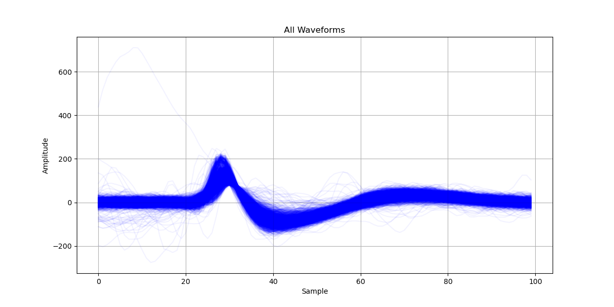
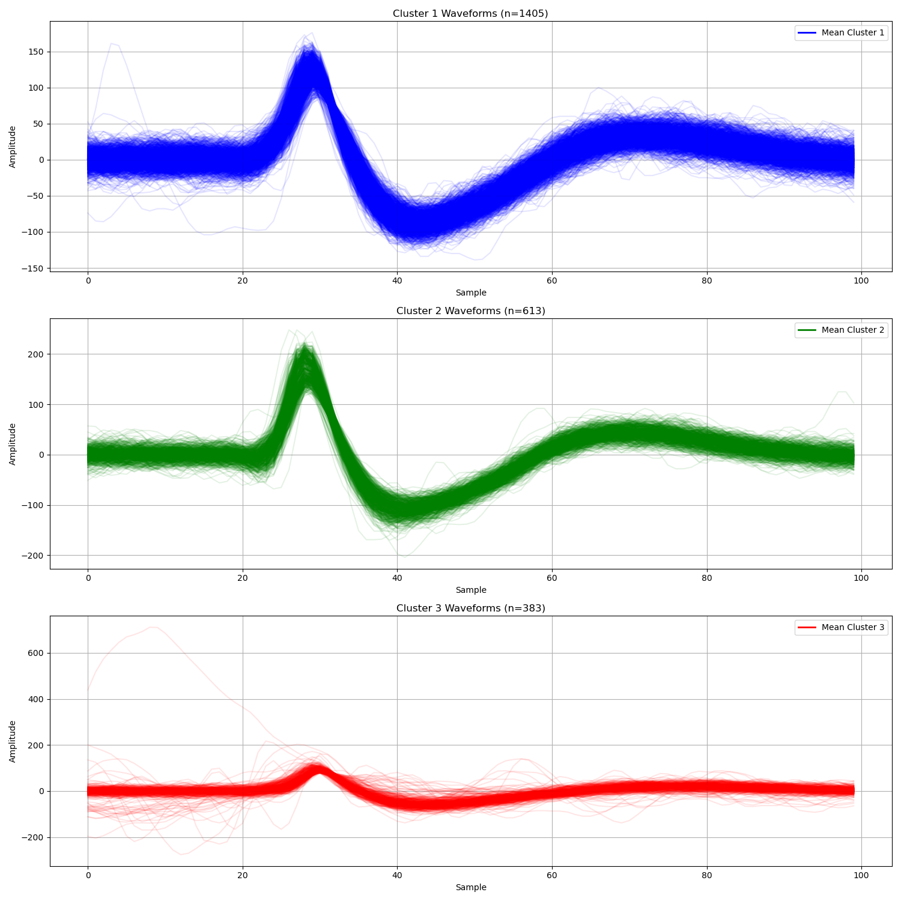
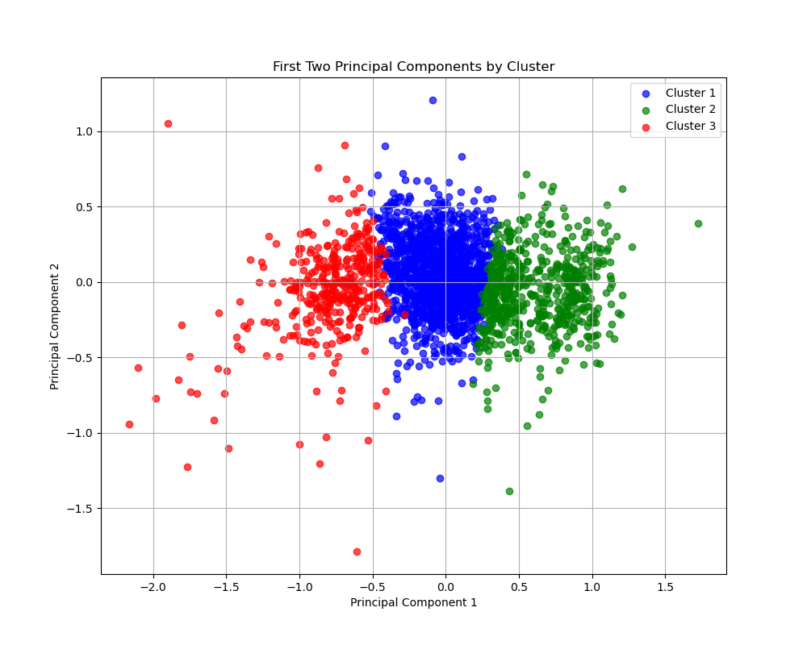
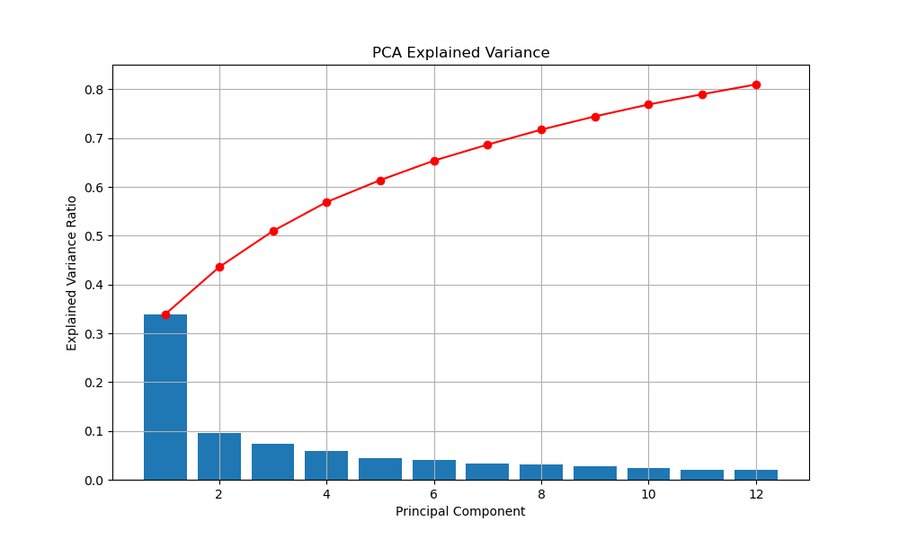
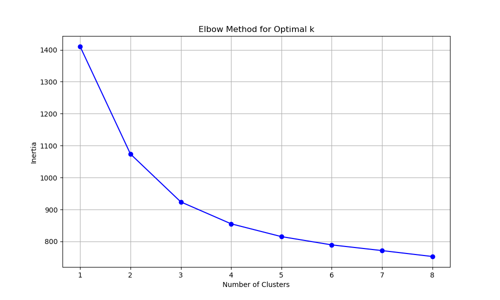
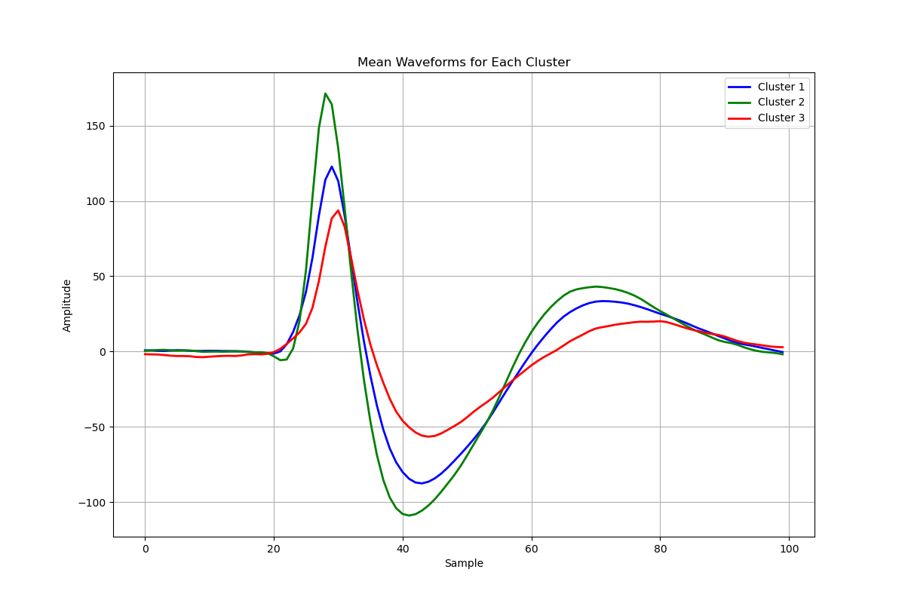
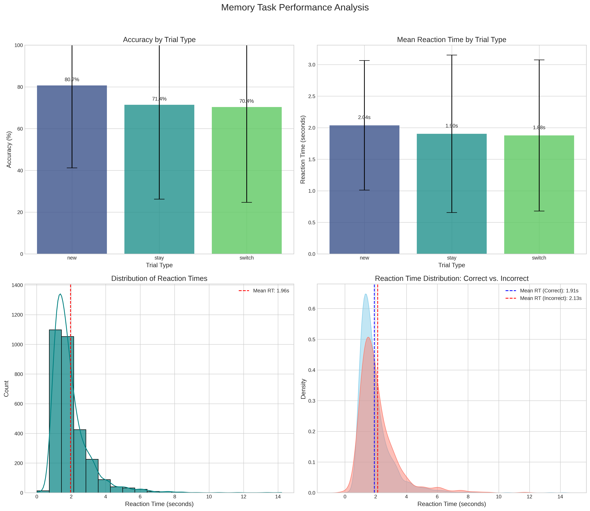

# Assignment 2 - Modeling data
Aaron Raycove

Netid: 790916206

Names of students you worked with on this assignment: Afra, Nathan

Note: this assignment falls under collaboration Mode 2: Individual Assignment – Collaboration Permitted. Please refer to the syllabus on Canvas for additional information.

Instructions for all assignments can be found here and in the course syllabus on canvas.

Total points in the assignment add up to 90; an additional 10 points are allocated to presentation quality.
# Learning Objectives
The purpose of this assignment is to provide a deeper understanding into some of the recent concepts we've covered. We'll work through a logistic regression analysis as well as apply some clustering technqiues using real brain data. We'll also get those group projects started. Please allow for enough time for this last section. This will set you up for your group project analyses and hopefully get those wheels in motion!!

Note: for all assignments, write out all equations and math using markdown and LaTeX. For this assignment show ALL math work

# Logistic regression
[30 points]

## Data. 
The data for this problem can be found in the data subfolder in the assignments folder on github. The filename is stroke.csv.

A stroke occurs when the blood flow to a part of the brain is reduced or restricted. Due to this brain cells start to die, in that part of the brain, at a very fast rate due to a lack of oxygen and nutrients. There are two types of brain strokes: (a) Ischemic stroke and (b) Haemorrhagic stroke of which ischemic stroke is more likely to occur. The rupture or blockage prevents blood and oxygen from reaching the brain’s tissues. Here we have used 8 input parameters like gender, age, various diseases, and smoking status in this dataset on brain stroke detection from Kaggle. The following information is provided about the patient: 

field 	            description
id 	                unique identifier
gender 	            'Male', 'Female', or 'Other'
age 	            age of patient
hypertension 	    0 if patient doesn't have hypertension; 1 if patient has hypertension
heart_disease 	    0 if patient doesn't have heart disease; 1 if patient has heart disease
ever_married 	    'No', 'Yes'
work_type 	        'children', 'Govt_jov', 'Never_worked', 'Private', 'Self-employed'
Residence_type 	    'Rural', 'Urban'
avg_glucose_level 	average glucose level of the patient
bmi 	            body mass index of the patient
smoking_status 	    'formerly smoked', 'never smoked', 'smokes', 'Unknown'
stroke 	            0 if patient has not had a stroke; 1 if patient has had a stroke

Your objective. For this dataset, your goal is to create a logistic regression model that predicts which patients will more likely have a stroke. Let's break it down:

## a. 
First load in the data. You've already explored this data a bit in the previous assignment, but it would be good to get know the data again. Start by exploring some distributions of stroke occurrences based on categorical and numerical features using histograms.
```
import statistics
import matplotlib
import matplotlib.pyplot as plt
import seaborn as sns
import numpy as np
import time

with open("stroke.csv", "r") as f:
    stroke_data = f.readlines()
for pos, line in enumerate(stroke_data):
    line = [i for i in line.split(",")]
    stroke_data[pos] = line
id_index                = 0
gender_index            = 1
age_index               = 2
hypertension_index      = 3
heart_disease_index     = 4
ever_married_index      = 5
work_type_index         = 6
Residence_type_index    = 7
avg_glucose_level_index = 8
bmi_index               = 9
smoking_status_index    = 10
stroke_index            = 11
del stroke_data[0]
stroke_data = np.array(stroke_data)


smoking_status = stroke_data[:, 10]  # 10th index (smoking)
unique_smoking_statuses = np.unique(smoking_status)
stroke_status = stroke_data[:, 11].astype(int)   # 11th index (stroke)

# Unique smoking categories and map them to numeric values
unique_smoking_statuses, smoking_numeric = np.unique(smoking_status, return_inverse=True)

plt.hist(
    [smoking_numeric[stroke_status == 1], smoking_numeric[stroke_status == 0]],
    bins=np.arange(len(unique_smoking_statuses) + 1) - 0.5,  # Center bins on categories
    alpha=0.7,
    label=["Stroke", "No Stroke"],
    edgecolor="black",
    stacked=True
)

plt.xlabel("Smoking Status")
plt.ylabel("Count")
plt.title("Smoking Status vs. Stroke")
plt.xticks(ticks=np.arange(len(unique_smoking_statuses)), labels=unique_smoking_statuses, rotation=30)
plt.legend()
plt.tight_layout()
plt.savefig("smoking_stroke.png")
```

## b. 
What do you see about the distribution of the number of patients who have had a stroke compared to the number of patients who have not had a stroke? Is this a balanced dataset?

- There are far more people who have not had a stroke compared to those who have
- Therefore the dataset is not balanced, especially since there are a large amount of null values mixed in, which makes any conclusions about the data not complete

## c. 
Data transformations: Since the dataset is a mixture of numeric and categorical data, use one-hot encoding to transform the categorical data. Then make sure to rescale your numerical data and either drop or impute missing values.

- Script was updated to one-hot encode data, histograms generated based on one-hot encoded table instead of numerical-categorical

## d. 
Calculate correlations and plot some heatmaps to see how these variables relate to one another.

## e. 
Use Scikit-Learn to perform logistic regression and show your results using classification_report. Interpret these results. What's the overall accuracy? But what is the precision and recall values for stroke and no stroke? What does this mean in terms of the imbalanced data?
### Interpretation of Initial Results
Overall accuracy: 0.9374
No stroke - Precision: 0.9388, Recall: 0.9983
Stroke - Precision: 0.5000, Recall: 0.0250

Observations:
1. The model shows high accuracy overall, but this is misleading due to imbalanced data
2. The precision for stroke prediction is high, meaning when the model predicts a stroke, it's often correct.
3. However, the recall for stroke is low, indicating the model often misses actual stroke cases.
    - Therefore not really that accurate is predicting strokes
    - This is problematic in a medical context where missing a positive case (stroke) is more harmful than a false alarm.
## f. 
Extra credit (5 points): Try to resample the data to address the imbalance and re-run logistic regression. How does this change your interpretation of the classification results?
### Interpretation of All Results
1. Original Imbalanced Data:
   - Overall Accuracy: 0.9374
   - Stroke Precision: 0.5000
   - Stroke Recall: 0.0250
   - With imbalanced data, the model achieved high accuracy but poor recall for stroke cases.
   - This means many stroke cases were missed, which indicates model overfits, unable to generalize.

2. After SMOTE Oversampling:
   - Overall Accuracy: 0.7739
   - Stroke Precision: 0.1785
   - Stroke Recall: 0.7250
   - SMOTE improved the recall for stroke cases significantly.
   - This means fewer stroke cases were missed, at the cost of slightly lower precision.

3. After Undersampling:
   - Overall Accuracy: 0.7347
   - Stroke Precision: 0.1565
   - Stroke Recall: 0.7375
   - Undersampling increased recall even further but at a greater cost to precision and overall accuracy.
   - This is the most aggressive approach to address class imbalance.

Conclusion:
- The imbalanced dataset problem is evident from the initial model's high accuracy but poor stroke recall.
- Resampling techniques help improve the model's ability to detect the minority class (stroke cases).
- SMOTE offers a good balance, improving stroke detection while maintaining reasonable precision.

## ANSWER


# PCA and KMeans
[25 points]

## Data. 
The data for this problem can be found in the data subfolder in the assignments folder on github. The filename is wave_form.csv.

Epilepsy is a form of brain disorder in which an excess of synchronous electrical brain activity leads to seizures which can range from having no outward symptom at all to jerking movements (tonic-clonic seizure) and loss of awareness (absence seizure). For some epilepsy patients surgical removal of the effected brain tissue can be an effective treatment. But before a surgery can be performed the diseased brain tissue needs to be precisely localized. To find this seizure focus, recording electrodes are inserted into the patients brain with which the neural activity can be monitored in real time. The electrophysiological data you'll be working with has been acquired from a human epilepsy patient and has already been processed to extract spike events.

Spike events reflect the activity of individual neurons and therefore can give important insights into the nature of the disease. However, a single electrode will typically pick up signals from more than one neuron at a time. While this might not be an issue for locating the seizure focus, research questions related to the mechanisms behind epileptic seizures often require a more detailed understanding of which neuron was active at what time. **So how can we figure out the how many neurons were contributing to our signal and when each of them was active?**

To do this we will use an unsupervised clustering algorithm (K-means clustering) to sort our spike data. However, the first thing we need to do is decide what features of our spike wave forms we want to feed into our algorithm. To do this, we will apply **principal component analysis** (PCA) and use the principal components as features. While before each spike wave form was represented by 90 samples the dimensionality is now reduced to only three features which allow us to assign each spike to a cluster.

All that's left is deciding how many clusters we expect to find. From literature review, we expect not to find more than two or three separable clusters from a single electrode recording. However, we'll also run the K-means function several times on our data and increase the number of clusters with every run. That way we can decide based on the 'Elbow method'. Ready? Let's go...

**Your objective. For this dataset, you'll perform an analysis to attribute spikes to neurons. Let's break it down:**

a. Load in the data and plot the wave forms on one plot.



b. Principal component analysis (PCA) is a dimensionality reduction method which requires normalized data. Use Scikit Learn for both the normalization (MinMaxScaler()) and PCA (you can use n_components=12).



c. Run KMeans from Scikit Learn on your reduced data several times using more and more clusters (n_clusters=1 to n_clusters=8). Plot the .inertia_ values for each corresponding cluster. Do you see an elbow? Where do you think it is?


d. Plot the wave forms for n_clusters=3.

e. What do these wave forms look like? Have you seen other plots with this shape before?

## ANSWER
import numpy as np
import pandas as pd
import matplotlib.pyplot as plt
from sklearn.preprocessing import MinMaxScaler
from sklearn.decomposition import PCA
from sklearn.cluster import KMeans

### a. Load the data and plot the wave forms on one plot
### Read the CSV file and assign to data as a pandas dataframe / With error handling
try:
    data = pd.read_csv('wave_form.csv')
    print("Data loaded with headers.")
except:
    try:
        data = pd.read_csv('wave_form.csv', header=None)
        print("Data loaded without headers.")
    except Exception as e:
        print(f"Error loading data: {e}")
        raise

#### Plot the waveforms for every piece of data
plt.figure(figsize=(12, 6))
for i in range(len(data)):
    plt.plot(range(data.shape[1]), data.iloc[i].values, color='blue', alpha=0.05)
plt.title('All Waveforms')
plt.xlabel('Sample')
plt.ylabel('Amplitude')
plt.grid(True)
plt.savefig('all_waveforms.png')

### b. Normalize data and perform PCA
scaler = MinMaxScaler()
scaled_data = scaler.fit_transform(data) # Scale data
pca = PCA(n_components=12) # Initialize PCA with 12 components
pca_result = pca.fit_transform(scaled_data) # Apply PCA on scaled data
print("\nPCA Results:")
print("Explained variance ratio     :", pca.explained_variance_ratio_)
print("Cumulative explained variance:", np.sum(pca.explained_variance_ratio_))
#### Plot the things!
plt.figure(figsize=(10, 6))
plt.bar(range(1, 13), pca.explained_variance_ratio_)
plt.plot(range(1, 13), np.cumsum(pca.explained_variance_ratio_), 'ro-')
plt.title('PCA Explained Variance')
plt.xlabel('Principal Component')
plt.ylabel('Explained Variance Ratio')
plt.grid(True)
plt.savefig('pca_variance.png')

### c. Run KMeans with different numbers of clusters and plot inertia
inertia_values = []
for n_clusters in range(1, 9):
    kmeans = KMeans(n_clusters=n_clusters, random_state=42)
    kmeans.fit(pca_result)
    inertia_values.append(kmeans.inertia_)
#### Plot THE ELBOW!
plt.figure(figsize=(10, 6))
plt.plot(range(1, 9), inertia_values, 'bo-')
plt.title('Elbow Method for Optimal k')
plt.xlabel('Number of Clusters')
plt.ylabel('Inertia')
plt.grid(True)
plt.savefig('elbow_method.png')
#### Elbow is around cluster 3

### d. Plot the wave forms for n_clusters=3
kmeans = KMeans(n_clusters=3, random_state=42)
cluster_labels = kmeans.fit_predict(pca_result)
#### Plot waveforms by cluster
plt.figure(figsize=(15, 15))
colors = ['blue', 'green', 'red']
labels = ['Cluster 1', 'Cluster 2', 'Cluster 3']
for cluster in range(3):
    cluster_indices = np.where(cluster_labels == cluster)[0]
    plt.subplot(3, 1, cluster+1)
    for idx in cluster_indices[:]:
        plt.plot(range(data.shape[1]), data.iloc[idx].values, color=colors[cluster], alpha=0.1)
    # Calculate and plot the mean waveform for this cluster
    mean_waveform = data.iloc[cluster_indices].mean()
    plt.plot(range(data.shape[1]), mean_waveform, color=colors[cluster], linewidth=2, label=f'Mean {labels[cluster]}')
    plt.title(f'{labels[cluster]} Waveforms (n={len(cluster_indices)})')
    plt.xlabel('Sample')
    plt.ylabel('Amplitude')
    plt.legend()
    plt.grid(True)
plt.tight_layout()
plt.savefig('cluster_waveforms.png')
#### Plot all mean waveforms together for comparison
plt.figure(figsize=(12, 8))
for cluster in range(3):
    cluster_indices = np.where(cluster_labels == cluster)[0]
    mean_waveform = data.iloc[cluster_indices].mean()
    plt.plot(range(data.shape[1]), mean_waveform, color=colors[cluster], linewidth=2, label=labels[cluster])
plt.title('Mean Waveforms for Each Cluster')
plt.xlabel('Sample')
plt.ylabel('Amplitude')
plt.legend()
plt.grid(True)
plt.savefig('mean_waveforms.png')
print("\nCluster sizes:")
for cluster in range(3):
    cluster_size = np.sum(cluster_labels == cluster)
    print(f"{labels[cluster]} size: {cluster_size}")
#### Plot first two principal components colored by cluster, YAY MORE PLOTS
plt.figure(figsize=(10, 8))
for cluster in range(3):
    cluster_indices = np.where(cluster_labels == cluster)[0]
    plt.scatter(
        pca_result[cluster_indices, 0],
        pca_result[cluster_indices, 1],
        color=colors[cluster],
        label=labels[cluster],
        alpha=0.7
    )
plt.title('First Two Principal Components by Cluster')
plt.xlabel('Principal Component 1')
plt.ylabel('Principal Component 2')
plt.legend()
plt.grid(True)
plt.savefig('pca_clusters.png')
plt.show()

### e. Interpretation of what these waveforms look like
- Interpretation:
- The wave forms very much look like action potentials
- Depolarization followed by repolarization, single action potentials
- The plots seem to exaggerate the hyperpolarization phase, 
- cluster 3 seems off, but there are some outliers plotted that change the scale of the graph, notice the 600 amplitude spike. This is likely erroneous data, as most neurons fire roughly the same way.

# Project data analysis
[35 points]

## Data. 
The data you'll use for this section will be related to your project (either the data you're working on with your group or a different dataset related to your question).

## Objective. 
For this you'll use a machine learning model (supervised or unsupervised... preferablly one we've discussed in class) to analyze your data. You can work with your group on this, but you should each submit a different analysis. Here's some expectations:

### a. Exploration and visualization: Do some data exploration with at least 3 plots.

### b. Preprocessing: Perform any necessary data transformations and handle any missing data. Explain what you did!
- handling N/A values I had those converted to 0's
- 
### c. Modeling: Pick a model and analyze your data. Explain your motivation behind this particular model. Do forget to split your data into training and testing sets!

### d. Evaluation: Evaluate your model. The metrics you use should be consistent with the model you chose. Explain your results.

### e. Insights: Provide any insights this modeling exercise gave you and how will it inform your future work on this project? Please write out your next steps for analyses.

ANSWER
